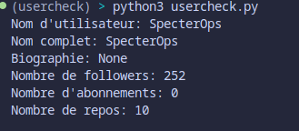
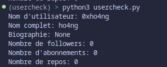

# Projet OSINT Usercheck Github Compte


[](https://ozint.eu) [](https://www.python.org/downloads/release/python-3116/) [](https://www.linkedin.com/in/lou-j/) [](licence) [](https://github.com/0xho4ng/usercheck-github/stargazers/)


Ce projet vise à créer un outil simple de vérification de présence d'un nom d'utilisateur sur les réseaux sociaux, en utilisant l'OSINT (Open Source Intelligence). Il utilise l'API GitHub pour récupérer des informations sur un utilisateur. C'était un projet crée pour un TP Open-Source.


## Installation de l'environnement Python avec venv

1. **Configuration d'un environnement virtuel Python sur Linux:**
---
**Assurez-vous avant de lancer le programme d'avoir Python installé sur votre ordinateur**

Créez un répertoire pour votre projet:
   ```bash 
   mkdir votre_nom_de_projet
   ```
Déplacez-vous dans votre dossier qui vient d'être crée:
   ```bash
   cd votre_nom_de_projet
   ```
Créez un environnement virtuel avec **venv** en lui attribuant un nom : 
   ```bash
   python3 -m venv nom_de_votre_environnement
   ```

Activer votre environnement virtuel: 
  ```bash
  source nom_de_votre_environnement/bin/activate
  ```
Installation du fichier requirements.txt 
  ```bash
  pip ou pip3 install -r requirements.txt
  ```
Désactiver votre environnement virtuel:
  ```bash
  deactivate
  ```
  


2. **Utilisation**


Exécutez le script
   ```bash
    python usercheck.py 
    ou
    python3 usercheck.py
   ```



3. Le programme affiche les informations sur l'utilisateur si le nom d'utilisateur est trouvé, sinon, il affiche un message indiquant que le nom d'utilisateur n'a pas été trouvé. 


4. **Update**

Demande à l'utisateur de rentrer son username de github pour avoir directement ses informations par rapport à son github.


